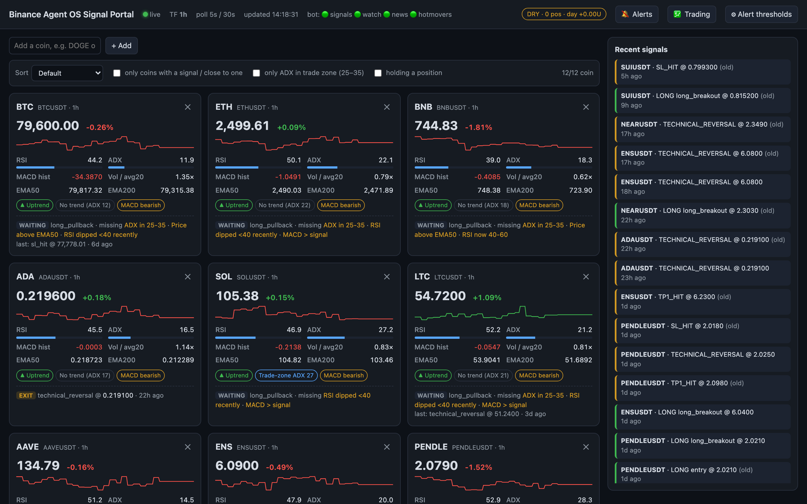
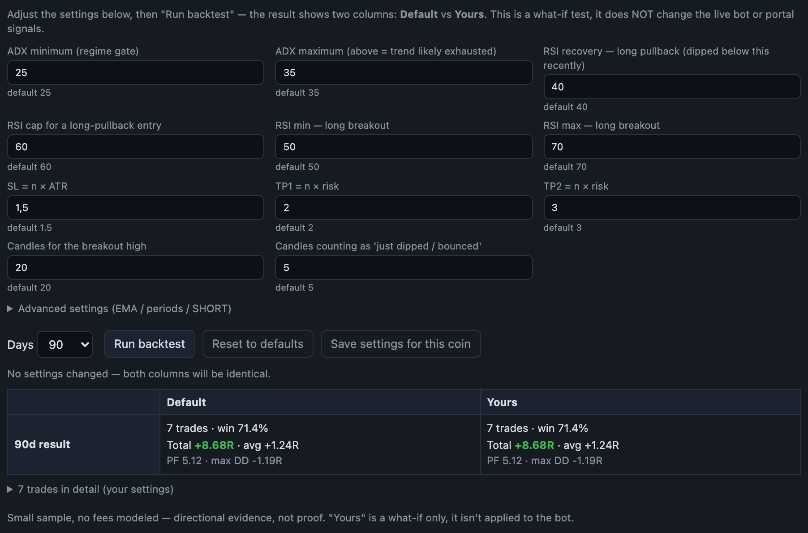
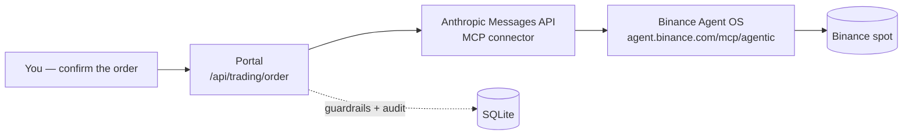
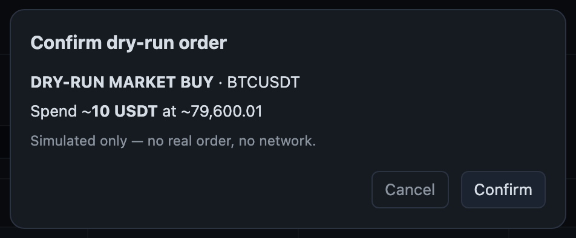

# Binance Agent OS Signal Portal — a detailed review

*A local, self-contained dashboard that turns a "Telegram-only" technical-signal bot into a
real-time control panel — and wires **spot order execution via Binance Agent OS (MCP)** into
the same page.*

- **Repo:** https://github.com/vuducdung1308/binance_agent_os_signal_portal
- **Stack:** one FastAPI process + WebSocket + SQLite + vanilla JS. Runs 100% locally, no auth,
  no Binance API key needed just to watch signals.
- **Install:** `git clone … && cd … && ./run.sh` → open `http://127.0.0.1:8777`.

> A Vietnamese version of this document is at [`review.vi.md`](review.vi.md).



---

## 1. Background — the problem it solves

I already run a Python bot ("Binansquare") that scans ~20 coins every hour, computes
EMA/RSI/MACD/ADX/ATR and fires signals to Telegram. The "Telegram-only" model has gaps:

- You can't see **why** a coin has *not* fired yet — which condition is missing, how far off it is.
- No price context: you get "LONG BTC, SL x, TP y" but no chart, no resistance zone, no
  trendline, no liquidity around that level.
- No way to ask "if the ADX floor were 22 instead of 25, what would the last 6 months look like".
- To act on a signal you open the Binance app, size the order against `stepSize` yourself, and
  watch out for `MIN_NOTIONAL`.

This portal adds a UI + analytics + execution layer on top of the bot **without changing the
bot's indicator math**. The signal engine is imported and run as-is.

---

## 2. Real-time dashboard

**Coin cards.** Each coin in the watchlist is a card showing:

| Field | Source |
|---|---|
| Price + 24h %, flashes green/red on every change | one batched `ticker/24hr` request for the whole watchlist, polled every **5 s** |
| RSI, ADX, MACD histogram, volume ratio (current candle / 20-candle avg) | the bot's indicators run over closed candles, every **30 s** |
| Trend (EMA50 vs EMA200), a 240-point price sparkline | SQLite snapshot every 60 s + an in-RAM buffer |
| Green border = a signal is live · amber border = close to a signal | engine-condition comparison |


Data is pushed over **WebSocket** — no polling in the browser, updates arrive as a push.

**Watchlist** lives in SQLite; add/remove coins right on the page, **no restart**. On first run
it seeds from the bot's `SIGNAL_COINS`; after that the SQLite copy is the source of truth.

**Sort & filter.** Sort by 24h % / RSI / ADX / "signals first"; filter to "only coins with or
near a signal", "only ADX in the trade zone (25–35)", "holding a position".

**"Recent signals" feed** on the right column — every recent entry/exit, tagged with its source
(`portal` = detected by the portal, `bot` = ingested from the bot's `.txt` files).

---

## 3. "Why no signal yet?" — an engine-condition breakdown

This is the feature I use most. Open a coin and the **Engine conditions** panel lists every
setup (`long_pullback`, `long_breakout`, `short_pullback`) and every gate inside it:

```
long_pullback                                    missing 2 conditions
  ✓ ADX in 25–35                                 ADX 27.4
  ✓ Uptrend (EMA50 > EMA200)                     64,210 / 61,880
  ✓ Price above EMA50                            64,980 / 64,210
  ✗ RSI dipped < 40 recently                     recent low 43.1
  ✗ RSI now 40–68                                RSI 71.2
  ✓ MACD > signal                                12.4 / 9.8
```


It is a **read-only mirror** of the exact gates in `compute_entry_signal` — it imports that
module's constants, it does not re-tune anything. The portal also names the "closest" setup and
lists the conditions it is still missing.

---

## 4. Chart + price-structure analytics (coin modal)

Real candles from Binance (including the forming candle), drawn with `lightweight-charts`, with
analytics layers on top — each layer toggles on/off, the choice is remembered in `localStorage`:

- **EMA50 / EMA200**
- **Support / resistance zones** — clustered swing pivots, with a touch count, and a hard cap on
  cluster width so one "zone" can't swallow the whole chart.
- **Auto trendlines** — connect the last two swing lows / swing highs, extended to now, flagged
  `broken` if price has since pierced the line.
- **RSI divergence** — price higher-high + RSI lower-high ⇒ bearish; the inverse ⇒ bullish.
  Connectors are drawn on both the price chart and the RSI sub-pane.
- **Liquidity** — recent swing highs/lows + equal-high / equal-low pools (buy-side / sell-side
  liquidity).
- **Volume + Volume Profile** — a per-candle volume histogram, plus POC and the 70% value area.
- **A synced RSI sub-pane** whose time axis tracks the main chart, with 70/30 lines.
- **Signal markers** — historical entries/exits are plotted directly on the chart.


All of these layers are **drawing aids** and never feed the signal engine.

---

## 5. Backtest — test indicator settings

The backtest tab runs **the bot's real production engine** over history (30 / 90 / 180 / 365
days), not a reimplementation.

The key move: the engine is **parameterized**. 19 fields in `SignalParams` are tunable:

- ADX min/max (the regime gate)
- RSI levels (recovery, overbought cap, continuation min/max, short trigger, oversold floor)
- SL = n × ATR, TP1/TP2 = n × risk
- candles for the breakout high, candles counting as "just dipped / bounced"
- EMA fast/slow, RSI, ATR, ADX periods
- SHORT signals on/off

The result shows **two columns side by side — Default vs Yours**: number of trades, win rate,
total R, average R, profit factor, max drawdown (in R), plus a per-setup breakdown and the
trade list.



You can **save a parameter set per coin** (to SQLite). This is purely what-if — it **does not
touch the live signals or the running bot**. The engine's defaults were verified byte-identical
after parameterization.

---

## 6. Notifications

- **Desktop notification + sound** the moment a new signal appears (toggle with the 🔕 button).
- **Telegram push** for every signal the portal detects — Entry / SL / TP1 / TP2, RSI/ADX, a
  source tag. A flag controls whether signals *ingested* from the bot's `.txt` files are also
  pushed (the real bot already sends those) — no double-notify.

<!-- Add your own screenshot of a signal message in Telegram:
 -->

---

## 7. Bot-health strip

The portal runs independently of the bot's LaunchAgent schedulers, so it has a separate status
strip reporting on them: it reads `launchctl list` for the four schedulers (`signals`, `watch`,
`news`, `hotmovers`) — are they running, what was the last exit code. A clean stop signal
(SIGTERM on reload/reboot) shows `ok`; a crash signal shows amber; not running shows red. There
is a log-mtime fallback for when launchctl has nothing to say.


---

## 8. Order execution & P/L via **Binance Agent OS (MCP)**

This is what sets the portal apart. Instead of hand-rolling Binance's HMAC-signed REST layer,
the portal talks to **a single MCP endpoint**: `https://agent.binance.com/mcp/agentic`.

### How it works

The portal calls the Anthropic Messages API with an **MCP connector** pointed at Binance Agent
OS. An LLM agent (`claude-sonnet-5`) takes a **structured intent** ("market BUY $10 of BTC, with
reference SL/TP") and composes the `spot_newOrder` tool call with the right parameters itself.



### Concrete benefits of Binance Agent OS here

| Hand-rolled REST | With the Binance Agent OS MCP |
|---|---|
| Sign HMAC-SHA256 yourself, manage `timestamp` / `recvWindow`, handle clock skew | the connector handles all of authentication |
| Read symbol filters yourself: `LOT_SIZE` / `stepSize`, `MIN_NOTIONAL`, `PRICE_FILTER`, then round the quantity | the agent reads the account + filters and rounds to a valid step size |
| Pick `quantity` vs `quoteOrderQty`, handle order-type quirks | describe the intent in natural language, the agent picks the parameters |
| One API key = full account access unless you scope it yourself | **default-deny toolset**: only 5 tools are enabled (`spot_newOrder`, `spot_getAccount`, `spot_tickerPrice`, `spot_getOpenOrders`, `spot_getOrder`). The model **cannot** call withdraw / transfer / futures / margin — blocked at the connector, not just in the prompt |
| Write the multi-step loop yourself (check price → check balance → place → confirm fill) | `pause_turn` lets the agent run a multi-step chain within one turn |
| Token tied to the main account | OAuth scoped to a **sub-account** — blast radius limited to one sub-account with your chosen limits |
| Auth only usable inside your own code | the same connector works from Claude Desktop, the API, MCP Inspector — portable auth |

### The portal's guardrails (a second layer, independent of MCP)

- **Kill switch** (manual + environment variable) — blocks every new opening order.
- **One position** at a time.
- **Per-order notional cap** (default $10).
- **Orders-per-day cap** (default 5).
- **Daily realised-loss limit** ($10) — hitting it trips the kill switch.
- **CLOSE is always allowed**, even with the kill switch on.
- **Manual + confirm**: every order shows a confirm dialog first, **no auto-execution**.
- **`dry-run` is the default**: nothing hits the network, a simulated fill with a fee model.



### P/L tracking

An open-positions table with a Close button, mark price from the live ticker, unrealised P/L +
%. Closed-trade history with realised P/L. And a full **audit log**: every agent call records
the intent, symbol, model, `stop_reason`, the tool-call JSON, the guardrail decision, the
returned text, and any error. There are quick buy/close buttons right inside the coin modal.


---

## 9. Architecture & non-goals

- **One process** — FastAPI (`lifespan` + `uvicorn[standard]`), a WebSocket fan-out hub,
  background `asyncio` loops, `asyncio.to_thread` for blocking `requests` calls.
- **SQLite** via the stdlib `sqlite3` (10 tables: watchlist, alert_config, engine_params,
  signal_event, indicator_snapshot, portal_position, trading_state, live_position, live_trade,
  agent_call).
- **The one coupling point with the bot** is `portal/bot_bridge.py` — `sys.path.insert` +
  `from src.* import …`. The bot's engine is vendored into `./bot` so `git clone && ./run.sh`
  runs standalone; point `BOT_ROOT` at a real checkout to also read its live paper positions +
  signal files.
- **Auto-start on macOS** via a LaunchAgent (`RunAtLoad`, `KeepAlive` on crash).
- **Non-goals:** does not change the bot's indicator math; no futures/margin; no auto-trading;
  dry-run by default; local-only, no auth (don't expose it beyond your LAN).

---

## 10. Wrap-up

The portal turns a "signals over Telegram" bot into:

1. **A watch desk** — real-time price, indicators, sparklines, sort/filter.
2. **A diagnostic tool** — see exactly which engine condition is missing.
3. **A chart-analysis desk** — S/R, trendlines, divergence, liquidity, volume profile.
4. **A backtest lab** — test indicator configs on the real engine, against the defaults.
5. **An execution desk** — place spot orders via **Binance Agent OS**, with confirmation,
   guardrails, and a full audit trail; track P/L in place.

And Binance Agent OS is what makes step 5 possible without a single line of Binance
request-signing code — describe the intent, the connector does the rest, and the default-deny
toolset keeps the blast radius exactly as small as you allow.
