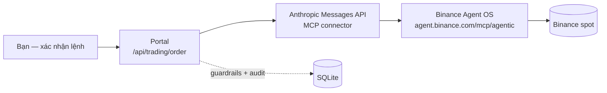

# Binance Agent OS Signal Portal — Review chi tiết


*Một dashboard local, mã nguồn tự chứa, biến bot tín hiệu kỹ thuật "chỉ bắn Telegram" thành
một bàn điều khiển thời gian thực — và cắm thẳng khả năng **đặt lệnh spot qua Binance Agent OS
(MCP)** vào cùng một trang.*

- **Repo:** https://github.com/vuducdung1308/binance_agent_os_signal_portal
- **Stack:** 1 tiến trình FastAPI + WebSocket + SQLite + vanilla JS. Chạy 100% local, không auth,
  không cần Binance API key để xem tín hiệu.
- **Cài đặt:** `git clone … && cd … && ./run.sh` → mở `http://127.0.0.1:8777`.

> Bản tiếng Anh của tài liệu này ở [`review.md`](review.md).


---

## 1. Bối cảnh — vấn đề nó giải quyết

Mình có sẵn một bot Python ("Binansquare") quét ~20 coin mỗi giờ, tính EMA/RSI/MACD/ADX/ATR
và bắn tín hiệu vào Telegram. Vấn đề của mô hình "chỉ có Telegram":

- Không thấy **vì sao** một coin *chưa* ra tín hiệu — thiếu điều kiện nào, còn cách bao xa.
- Không có bối cảnh giá: nhận được "LONG BTC, SL x, TP y" nhưng không thấy chart, vùng kháng cự,
  trendline, thanh khoản quanh đó.
- Không thử nghiệm được "nếu ngưỡng ADX là 22 thay vì 25 thì 6 tháng qua lời/lỗ ra sao".
- Muốn vào lệnh phải mở app Binance, tự tính khối lượng theo `stepSize`, tự canh `MIN_NOTIONAL`.

Portal này gắn một lớp giao diện + phân tích + thực thi lên trên bot **mà không sửa logic tính
chỉ báo của bot**. Engine tín hiệu được import và chạy nguyên bản.

---

## 2. Dashboard thời gian thực

**Thẻ coin (card).** Mỗi coin trong watchlist là một thẻ hiển thị:

| Trường | Nguồn |
|---|---|
| Giá + % 24h, nhấp nháy xanh/đỏ mỗi lần đổi | 1 request `ticker/24hr` gộp cho cả watchlist, poll mỗi **5 giây** |
| RSI, ADX, MACD histogram, tỉ lệ volume (nến hiện tại / TB 20 nến) | chạy chỉ báo của bot trên nến đã đóng, mỗi **30 giây** |
| Trend (EMA50 vs EMA200), sparkline 240 điểm giá gần nhất | SQLite snapshot mỗi 60s + buffer trong RAM |
| Viền xanh = đang có tín hiệu · viền vàng = gần ra tín hiệu | so điều kiện engine |


Đẩy dữ liệu qua **WebSocket** — không polling ở phía trình duyệt, cập nhật là push tức thì.

**Watchlist** lưu trong SQLite; thêm/xóa coin ngay trên trang, **không cần restart**. Lần chạy
đầu nó seed từ `SIGNAL_COINS` của bot, sau đó bản SQLite là nguồn sự thật.

**Sắp xếp & lọc.** Sort theo % 24h / RSI / ADX / "có tín hiệu trước"; lọc "chỉ coin có hoặc
gần tín hiệu", "chỉ ADX trong vùng giao dịch 25–35", "đang giữ vị thế".

**Feed "Recent signals"** ở cột phải — mọi tín hiệu entry/exit gần đây, kèm nhãn nguồn
(`portal` do portal tự phát hiện, `bot` lấy từ file `.txt` của bot thật).

---

## 3. "Vì sao chưa có tín hiệu?" — bảng phân tích điều kiện engine

Đây là tính năng mình dùng nhiều nhất. Mở một coin ra, phần **Engine conditions** liệt kê từng
setup (`long_pullback`, `long_breakout`, `short_pullback`) và từng cổng điều kiện của nó:

```
long_pullback                                    thiếu 2 điều kiện
  ✓ ADX trong 25–35                              ADX 27.4
  ✓ Uptrend (EMA50 > EMA200)                     64,210 / 61,880
  ✓ Giá trên EMA50                               64,980 / 64,210
  ✗ RSI đã nhúng < 40 gần đây                    đáy gần nhất 43.1
  ✗ RSI hiện 40–68                               RSI 71.2
  ✓ MACD > signal                               12.4 / 9.8
```


Nó là **bản soi chiếu chỉ đọc** của đúng các cổng trong `compute_entry_signal` — import hằng số
từ chính module đó, không tinh chỉnh lại gì. Portal còn chỉ ra setup "gần khớp nhất" và danh
sách điều kiện còn thiếu.

---

## 4. Chart + phân tích cấu trúc giá (modal coin)

Nến thật từ Binance (kèm cả nến đang hình thành), vẽ bằng `lightweight-charts`, phủ lên các lớp
phân tích — bật/tắt từng lớp, lựa chọn được nhớ trong `localStorage`:

- **EMA50 / EMA200**
- **Vùng hỗ trợ / kháng cự** — gom cụm các đỉnh/đáy swing, có số lần chạm, chặn bề rộng cụm
  để không bị "một vùng nuốt cả biểu đồ".
- **Trendline tự động** — nối 2 swing low / swing high gần nhất, kéo dài đến hiện tại, đánh dấu
  cờ `broken` nếu giá đã xuyên qua.
- **Phân kỳ RSI** — giá đỉnh sau cao hơn + RSI đỉnh sau thấp hơn ⇒ phân kỳ giảm; ngược lại cho
  phân kỳ tăng. Vẽ đường nối trên cả chart giá và ô RSI phụ.
- **Thanh khoản** — swing highs/lows gần đây + các "pool" đỉnh-bằng-nhau / đáy-bằng-nhau
  (buy-side / sell-side liquidity).
- **Volume + Volume Profile** — histogram khối lượng theo nến, cộng POC và vùng giá trị 70%.
- **Ô RSI phụ** đồng bộ trục thời gian với chart chính, có đường 70/30.
- **Marker tín hiệu** — các entry/exit trong lịch sử được chấm thẳng lên chart.


Tất cả các lớp này là **công cụ vẽ hỗ trợ**, không đưa vào engine tín hiệu.

---

## 5. Backtest — kiểm thử cấu hình chỉ báo

Tab backtest chạy **đúng engine sản xuất của bot** trên dữ liệu lịch sử (30 / 90 / 180 / 365
ngày), không phải bản viết lại.

Điểm cốt lõi: engine đã được **tham số hóa**. 19 trường trong `SignalParams` có thể chỉnh:

- ngưỡng ADX min/max (cổng regime)
- các mức RSI (recovery, overbought cap, continuation min/max, short trigger, oversold floor)
- SL = n × ATR, TP1/TP2 = n × risk
- số nến cho breakout high, số nến tính "vừa nhúng/bật"
- chu kỳ EMA fast/slow, RSI, ATR, ADX
- bật/tắt tín hiệu SHORT

Kết quả hiển thị **2 cột cạnh nhau — Default vs Yours**: số lệnh, win rate, tổng R, R trung
bình, profit factor, max drawdown (theo R), và tách nhỏ theo từng setup + danh sách lệnh.


Có thể **lưu bộ tham số cho riêng từng coin** (vào SQLite). Đây thuần túy là what-if — **không
đụng đến tín hiệu live hay bot đang chạy**. Mặc định của engine được xác nhận là byte-identical
sau khi tham số hóa.

---

## 6. Thông báo

- **Desktop notification + âm thanh** ngay khi có tín hiệu mới (bật/tắt bằng nút 🔕).
- **Telegram push** cho mọi tín hiệu portal tự phát hiện — Entry / SL / TP1 / TP2, RSI/ADX,
  nhãn nguồn. Có cờ để *không* đẩy lại các tín hiệu ingest từ file của bot (vì bot thật đã tự
  gửi rồi) — tránh double-notify.

<!-- Thêm ảnh chụp một tin nhắn tín hiệu trong Telegram của bạn:
 -->

---

## 7. Bot-health strip

Portal chạy độc lập với các scheduler LaunchAgent của bot, nên có một dải trạng thái riêng
báo cáo về chúng: đọc `launchctl list` cho 4 scheduler (`signals`, `watch`, `news`, `hotmovers`)
— đang chạy không, exit code lần cuối là gì. Tín hiệu dừng sạch (SIGTERM khi reload/reboot) hiển
thị `ok`; crash signal hiển thị vàng; không chạy hiển thị đỏ. Có fallback theo mtime của log
khi launchctl không nói gì.


---

## 8. Đặt lệnh & theo dõi P/L qua **Binance Agent OS (MCP)**

Đây là phần khiến portal khác biệt. Thay vì tự viết lớp ký HMAC + REST của Binance, portal nói
chuyện với **một MCP endpoint duy nhất**: `https://agent.binance.com/mcp/agentic`.

### Cách hoạt động

Portal gọi Anthropic Messages API với **MCP connector** trỏ tới Binance Agent OS. Một agent LLM
(`claude-sonnet-5`) nhận **ý định có cấu trúc** ("market BUY $10 BTC, kèm SL/TP tham chiếu") và
tự soạn lời gọi tool `spot_newOrder` với tham số đúng.



### Lợi ích cụ thể của Binance Agent OS ở đây

| Nếu tự viết REST | Với Binance Agent OS MCP |
|---|---|
| Tự ký HMAC-SHA256, quản lý `timestamp` / `recvWindow`, xử lý lệch giờ | Connector lo hết phần xác thực |
| Tự đọc filter symbol: `LOT_SIZE` / `stepSize`, `MIN_NOTIONAL`, `PRICE_FILTER` rồi làm tròn khối lượng | Agent tự đọc account + filter, tự làm tròn về step size hợp lệ |
| Tự chọn `quantity` vs `quoteOrderQty`, tự lo các quirk loại lệnh | Mô tả ý định bằng ngôn ngữ tự nhiên, agent chọn tham số |
| Một API key = toàn quyền tài khoản trừ khi tự phân quyền | **Toolset default-deny**: chỉ 5 tool được bật (`spot_newOrder`, `spot_getAccount`, `spot_tickerPrice`, `spot_getOpenOrders`, `spot_getOrder`). Model **không thể** gọi withdraw / transfer / futures / margin — bị chặn ở tầng connector, không chỉ ở prompt |
| Tự viết vòng lặp nhiều bước (xem giá → xem số dư → đặt → xác nhận khớp) | `pause_turn` cho phép agent chạy chuỗi nhiều bước trong một lượt |
| Token gắn với tài khoản chính | OAuth scope theo **sub-account** — phạm vi rủi ro giới hạn ở một sub-account với hạn mức mình chọn |
| Auth chỉ dùng được trong code của mình | Cùng connector đó chạy được từ Claude Desktop, API, MCP Inspector — auth di động |

### Guardrail của portal (tầng bảo vệ thứ hai, độc lập với MCP)

- **Kill switch** (thủ công + biến môi trường) — chặn mọi lệnh mở mới.
- **Chỉ 1 vị thế** tại một thời điểm.
- **Trần notional mỗi lệnh** (mặc định $10).
- **Trần số lệnh/ngày** (mặc định 5).
- **Trần lỗ thực hiện trong ngày** ($10) — chạm là tự bật kill switch.
- Lệnh **CLOSE luôn được phép**, kể cả khi kill switch bật.
- **Thủ công + xác nhận**: mọi lệnh hiện hộp xác nhận trước, **không có auto-execute**.
- **`dry-run` là mặc định**: không có gì chạm mạng, mô phỏng khớp lệnh kèm mô hình phí.


### Theo dõi P/L

Bảng vị thế mở với nút Close, giá mark lấy từ ticker live, P/L chưa thực hiện + %. Lịch sử lệnh
đã đóng có realized P/L. Và một **audit log đầy đủ**: mỗi lần gọi agent ghi lại intent, symbol,
model, `stop_reason`, JSON các tool call, quyết định guardrail, text trả về, lỗi (nếu có). Có
nút mua/đóng nhanh ngay trong modal coin.


---

## 9. Kiến trúc & phi mục tiêu

- **Một tiến trình** FastAPI (`lifespan` + `uvicorn[standard]`), hub fan-out WebSocket, các
  vòng lặp `asyncio` nền, `asyncio.to_thread` cho các call `requests` chặn.
- **SQLite** qua `sqlite3` stdlib (10 bảng: watchlist, alert_config, engine_params,
  signal_event, indicator_snapshot, portal_position, trading_state, live_position, live_trade,
  agent_call).
- **Điểm ghép nối duy nhất với bot** là `portal/bot_bridge.py` — `sys.path.insert` + `from src.*
  import …`. Engine của bot được vendor sẵn vào `./bot` nên `git clone && ./run.sh` chạy được
  standalone; trỏ `BOT_ROOT` sang checkout thật để đọc thêm vị thế paper live + file tín hiệu
  của nó.
- **Auto-start trên macOS** qua LaunchAgent (`RunAtLoad`, `KeepAlive` khi crash).
- **Không làm:** không sửa toán chỉ báo của bot; không futures/margin; không auto-trade; mặc
  định dry-run; local-only, không auth (đừng expose ra ngoài mạng LAN).

---

## 10. Tổng kết

Portal biến một bot "tín hiệu qua Telegram" thành:

1. **Bàn quan sát** — giá real-time, chỉ báo, sparkline, sort/filter.
2. **Công cụ chẩn đoán** — thấy chính xác điều kiện engine nào đang thiếu.
3. **Bàn phân tích chart** — S/R, trendline, phân kỳ, thanh khoản, volume profile.
4. **Phòng lab backtest** — thử cấu hình chỉ báo trên engine thật, so với mặc định.
5. **Bàn thực thi** — đặt lệnh spot qua **Binance Agent OS**, có xác nhận, guardrail, và audit
   đầy đủ; theo dõi P/L tại chỗ.

Và Binance Agent OS là thứ khiến bước 5 không cần một dòng code ký request Binance nào — mô tả
ý định, connector lo phần còn lại, và toolset default-deny giữ cho phạm vi rủi ro đúng bằng cái
mình cho phép.
